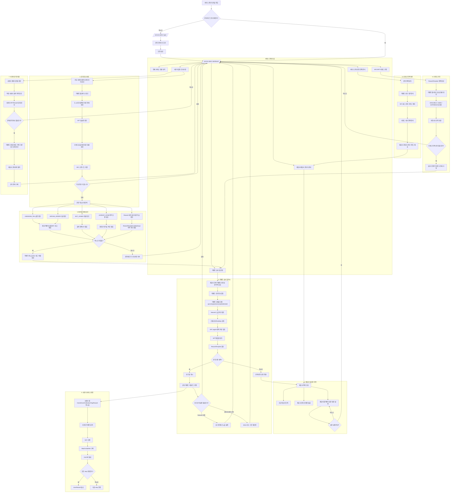

# 서비스 전체 관리자 기준 플로우 차트

현재 프로젝트의 실제 코드, 시드 데이터, 그리고 [05_user-flow-chart.md](c:\Users\dltmd\Desktop\land-in\docs\05_user-flow-chart.md), [06_partner-admin-flow-chart.md](c:\Users\dltmd\Desktop\land-in\docs\06_partner-admin-flow-chart.md)를 바탕으로 정리한 **서비스 전체 관리자(super admin)** 관점의 운영 플로우입니다.

이 문서는 현재 코드에 이미 존재하는 도메인들을 중심으로 구성했습니다.

- 사용자 도메인: `User`
- 이벤트 도메인: `Event`, `EventStatus(UPCOMING, ACTIVE, COMPLETED, ENDED)`, `featured`
- 참여/진행 도메인: `EventParticipation`, `Step`, `StepCompletion`
- NFC 도메인: `NfcTag`, `NfcScanLog`, `NfcScanResult(SUCCESS, ALREADY_DONE, WRONG_ORDER, NOT_JOINED, UNKNOWN_TAG)`
- NFT 도메인: `NftTemplate`, `UserNft`
- 리워드 도메인: `RewardTemplate`, `UserReward`, `RewardStatus(AVAILABLE, USED, EXPIRED)`

참고:

- 현재 코드에는 아직 `service admin`, `partner admin` 같은 역할 모델과 전용 관리자 API가 없습니다.
- 아래 흐름은 **지금 서비스 구조를 실제 운영 가능한 관리자 콘솔로 확장한다는 가정** 아래 정리한 문서입니다.

## 핵심 해석

- 서비스 전체 관리자는 단순히 이벤트를 등록하는 사람이 아니라, **제휴사 관리자 운영 + 이벤트 심사 + 사용자 서비스 반영 + 실시간 운영 모니터링**을 모두 담당하는 상위 운영자입니다.
- [05_user-flow-chart.md](c:\Users\dltmd\Desktop\land-in\docs\05_user-flow-chart.md)의 사용자 플로우는 이 문서의 `사용자 서비스 반영` 이후에 실제로 발생하는 결과 흐름이고, [06_partner-admin-flow-chart.md](c:\Users\dltmd\Desktop\land-in\docs\06_partner-admin-flow-chart.md)의 제휴사 관리자 플로우는 이 문서의 `이벤트 심사 및 게시` 직전 단계로 연결됩니다.
- 현재 실제 백엔드 코드에서 운영 리스크가 큰 지점은 `Event status`, `featured`, `tagUid`, `step order`, `RewardTemplate`, `NfcScanLog` 입니다. 서비스 관리자 플로우는 결국 이 값들을 안전하게 통제하는 구조여야 합니다.
- 특히 `NfcScanResult` 로그와 `RewardStatus` 분포는 운영자가 서비스 품질을 체감하는 핵심 지표가 될 가능성이 큽니다.
- 아직 관리자 역할/권한 모델이 없기 때문에, 실제 구현 시에는 최소한 `service admin > partner admin > end user`의 권한 레이어를 먼저 정의하는 것이 좋습니다.
