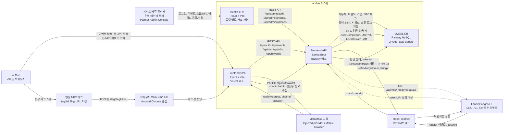

# Land-in 시스템 컨텍스트 다이어그램

현재 코드와 배포 문서 기준의 상위 시스템 경계입니다.

## 컨텍스트 요약

- 사용자는 Vercel에 배포된 React 앱을 통해 로그인, 이벤트 참여, NFC 인증, NFT/리워드 조회를 수행합니다.
- NFC 태그는 자체 서버가 아니라 `tagUid` 또는 `/tag?tagUid=...` URL을 담는 물리 매체입니다.
- 백엔드는 Railway의 Spring Boot API이며 인증, 이벤트, 참여, NFC 검증, NFT, 리워드 도메인을 처리합니다.
- MySQL은 현재 JPA `ddl-auto: update`로 스키마가 생성되는 영속 저장소입니다.
- 지갑 연결은 MetaMask를 통해 주소와 Hoodi 체인 정보를 백엔드에 저장합니다.
- 온체인 민팅은 백엔드가 Hoodi RPC로 `LandinBadgeNFT.safeMint(address,string)`를 호출하는 구조입니다.
- 관리자/제휴사 운영 흐름은 `frontend-admin` React 앱과 `/api/admin/**` 백엔드 API로 구현되어 있습니다.
- 관리자 계정은 `admins` 테이블에 저장되며, 초기 계정은 `AdminBootstrap`이 관리자 데이터가 없을 때 1회 생성합니다.
- 관리자 콘솔에서 이벤트, 스텝, NFC 태그 UID, NFT 템플릿, 완료 보상 템플릿을 등록하고 대표 이미지는 `/api/admin/uploads/images`로 업로드합니다.
